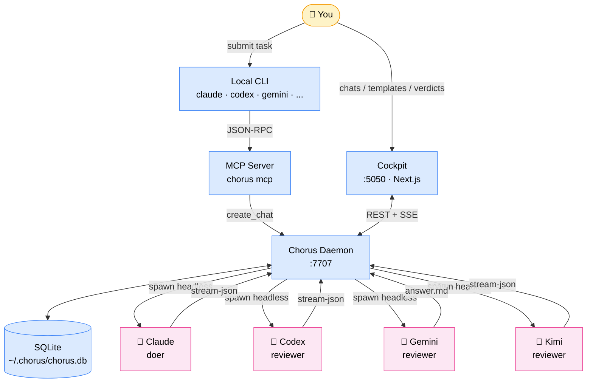
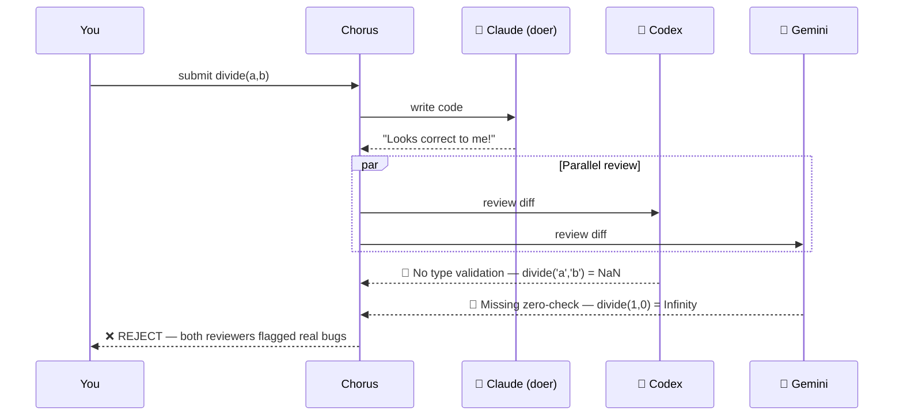
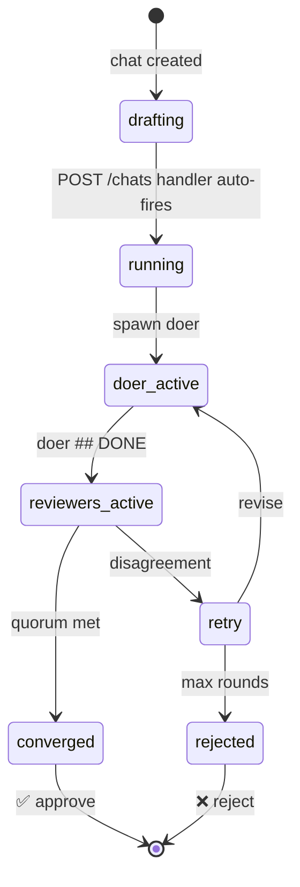
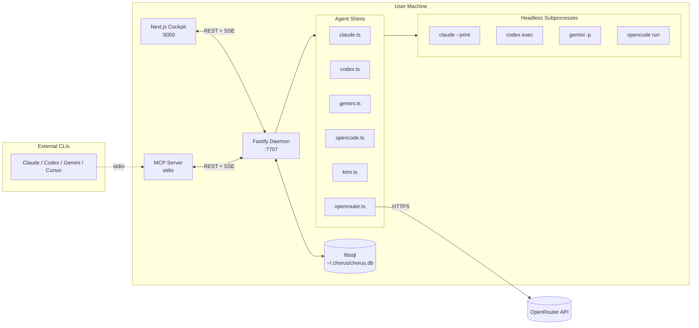

<div align="center">


# Chorus

**Driver-agnostic multi-LLM peer review for code decisions.**
Bring your own CLI. Chorus convenes 2–4 other LLMs to review the work before you ship.

[](https://github.com/99xAgency/chorus/actions/workflows/ci.yml)
[](https://www.npmjs.com/package/chorus-codes)
[](./LICENSE)
[]()
[]()
[](#contributing)

[Website](https://chorus.codes) · [Docs](./docs) · [Roadmap](./ROADMAP.md) · [Issues](https://github.com/99xAgency/chorus/issues)

---


*One AI writes. Three review. You ship only when they agree.*

</div>

---

## Why Chorus?

The same model that wrote your code can't catch its own blind spots. Chorus runs your work past 2–3 **different** LLMs from **different vendors**, in parallel, and only green-lights the merge when they agree.

| Without Chorus | With Chorus |
|---|---|
| One AI writes + reviews its own code | One AI writes, 2–4 others review |
| Confident-but-wrong is invisible | Disagreement = red flag |
| You ship, then debug at 2am | Reviewers catch it before merge |
| Lock-in to a single vendor | Portable across Claude / GPT / Gemini / Kimi / DeepSeek |

> **Lineage diversity is the moat.** A second Claude reviewing a first Claude's work is theatre. Chorus templates declare a `crossLineage` slot policy and the built-in templates compose reviewers from different model families. Cross-lineage validation is per-template — author your own with the same constraint.

---

## See it in action

<table>
<tr>
<td width="50%" align="center">
<b>Live run page</b><br/>
<br/>
<sub>Reviewers stream their verdicts live as the run progresses.</sub>
</td>
<td width="50%" align="center">
<b>Verdict & diff</b><br/>
<br/>
<sub>Disagreement triggers retry; agreement greenlights merge.</sub>
</td>
</tr>
<tr>
<td width="50%" align="center">
<b>Template editor</b><br/>
<br/>
<sub>Compose voices + personas into reusable review patterns.</sub>
</td>
<td width="50%" align="center">
<b>MCP integration</b><br/>
<br/>
<sub>Any MCP-aware CLI can trigger a Chorus run.</sub>
</td>
</tr>
</table>

> Replace the placeholders above by dropping GIFs into [`docs/images/`](./docs/images/). See [`docs/images/README.md`](./docs/images/README.md) for sizing + capture conventions.

---

## Quick start

```bash
npm i -g chorus-codes   # install
chorus init             # auto-detects every AI CLI on your machine
chorus start --ui       # boots daemon + opens http://localhost:5050
```

That's it. Open the cockpit, paste a task, hit **Submit**. Watch the LLMs argue.

> **Requires** Node ≥ 20 and **at least one** of: Claude Code, Codex CLI, Gemini CLI, OpenCode, Kimi CLI — *or* an OpenRouter API key.

<details>
<summary><b>Don't have any of those installed?</b></summary>

```bash
# Install one CLI to get started — pick whichever vendor you already have a sub for
npm i -g @anthropic-ai/claude-code
# or
npm i -g @openai/codex
# or
npm i -g @google/gemini-cli
# or use OpenRouter (no CLI needed) — add key in Settings after `chorus init`
```

</details>

---

## How it works



Each LLM runs as an isolated subprocess. Chorus parses their stream-JSON output, compares verdicts against the template's quorum rule (e.g. *"both reviewers must approve"*), and emits a final state.

---

## A real example

You ask Claude to write a divide function:

```js
function divide(a, b) {
  return a / b;
}
```

Submit to Chorus with the **Code Review** template (1 doer + 2 reviewers, both must agree):



Now you know what to fix **before** you push.

---

## Run lifecycle



> **Auto-fires on create.** `POST /chats` starts the runner immediately; SSE subscribers (cockpit on page open, programmatic callers via `chats/:id/stream`) only *observe* progress. Earlier 0.7 builds gated execution on first SSE subscriber — the gate moved into the create handler so headless callers don't need to subscribe just to make the run start.

---

## Supported LLMs

Chorus auto-detects whichever AI tools you already have:

| AI Tool | Can call Chorus | Can review | Auth | Notes |
|---|:---:|:---:|---|---|
| 🤖 **Claude Code** | ✅ | ✅ | sub or API | Anthropic |
| 🦾 **Codex CLI** | ✅ | ✅ | sub or API | OpenAI |
| 💎 **Gemini CLI** | ✅ | ✅ | sub or API | Google |
| 🌊 **OpenCode** | ✅ | ✅ | sub or API | Routes to Kimi/DeepSeek/Qwen/Z.AI |
| 🌙 **Kimi CLI** | ✅ | ✅ | Moonshot sub | MoonshotAI |
| 🔌 **OpenRouter** | — | ✅ | API key | 200+ models, no CLI needed |
| ⚡ Cursor | ✅ | — | — | IDE, not headless |
| 🏄 Windsurf | ✅ | — | — | IDE, not headless |

You don't need them all. **Two different vendors** is the minimum for meaningful diversity.

---

## Templates

A **template** = (1 doer + N reviewers + quorum rule). Pick one when you submit:

| Template | Pattern | Best for |
|---|---|---|
| 🐛 `bug-diagnose` | Hypothesis vs challenge | "Why is this broken?" |
| 👨‍⚖️ `code-review` | Doer + 2 reviewers, both agree | Pre-merge gate |
| 🏗️ `architect-review` | Cross-vendor design critique | Big decisions |
| ⚔️ `red-green` | One writes tests, another writes code | Adversarial TDD |
| 🔍 `review-only` | Paste a diff, 3 reviewers critique | Quick external audit |
| 🔺 `tri-review` | Doer + 3 reviewers (2-of-3) | Extra coverage |

Drop a YAML file in `~/.chorus/templates/` to add your own. Each reviewer slot can wear a **persona** — Sentinel (security), Cartographer (cross-platform), Accountant (cost), Profiler (perf), Inspector, Quartermaster, Concierge, Conservator, Librarian, Translator.

<details>
<summary><b>Example: custom template YAML</b></summary>

```yaml
id: security-pre-merge
label: Security Pre-Merge
description: Sentinel persona on every reviewer; quorum requires unanimous approval.
slots:
  doer:
    lineage: anthropic
    model: claude-sonnet-4-6
    persona: default
  reviewers:
    - { lineage: openai, model: codex,             persona: sentinel }
    - { lineage: google, model: gemini-2.5-pro,    persona: sentinel }
    - { lineage: opencode, model: opencode-go/kimi-k2.6, persona: sentinel }
quorum:
  type: unanimous
```

</details>

---

## Permissions & safety

Reviewers can run on your machine. You decide how much trust they get:

| Mode | Read | Write | Network | When to use |
|---|:---:|:---:|:---:|---|
| 🔒 **Strict** | ✅ | ❌ | ❌ | Pasting unknown diffs |
| 📁 **Workspace** *(default)* | ✅ | ✅ inside chat dir | ❌ | Day-to-day work |
| 🔓 **Full** | ✅ | ✅ | ✅ | Personal machine, full trust |

Configure on first run, or anytime at `/settings/permissions`.

> **Trust model.** The sandbox is the wall — once a doer is running inside
> Workspace mode, it can shell-out and modify files within its chat directory
> without prompting. `autoApprovePrompts` is on by default to keep flow
> uninterrupted. **Running a doer = trusting that doer to operate inside its
> sandbox.** Run `chorus doctor` to confirm sandbox is enforced for every
> CLI on your host (OpenCode and Kimi historically ignored sandbox; chorus
> now fails closed when they're asked to run in Strict mode).

---

## Architecture deep-dive

<details>
<summary><b>Click to expand</b></summary>



**Key components:**

- **Cockpit** ([`src/app/`](./src/app/)) — Next.js 16 UI on `:5050`. Templates, chats, voices, settings, permissions.
- **Daemon** ([`src/daemon/`](./src/daemon/)) — Fastify server on `:7707`. Owns the DB, spawns subprocesses, exposes REST + SSE.
- **Agent shims** ([`src/daemon/agents/`](./src/daemon/agents/)) — One per CLI lineage. Maps voice config → headless invocation + parses stream-JSON.
- **MCP server** ([`src/mcp/`](./src/mcp/)) — JSON-RPC over stdio. Lets external CLIs (Claude, Codex, …) trigger runs programmatically.
- **DB** — libsql/SQLite at `~/.chorus/chorus.db`. Schema: voices, personas, templates, chats, participants, messages, settings.

**Voice = (id, label, source, provider, model_id, lineage, cost, enabled)**. Source is `'cli'` (auto-populated from CLI detect at boot) or `'api'` (OpenRouter, etc.). Lineage drives diversity scoring; `vendor_family` carries the underlying model family for cost UX.

</details>

---

## Cost

Chorus runs the CLIs you already have — cost depends on how you're paying for those:

- **CLI subscriptions** (Claude Pro / ChatGPT Plus / Gemini Advanced — ~$20/mo each): typical chat = **$0** out of pocket, counts against your quota.
- **API keys** (pay-per-token): typical code-review chat (Opus + GPT-5.5 + Gemini Pro) = roughly **$0.30–$1.50** depending on diff size. Disagreement → retry → 2–3× worst case.

Chorus adds **no markup**. We don't see your tokens. The cockpit shows estimated cost on every run.

---

## Commands

```bash
chorus init                          # detect + connect every CLI
chorus init --connect claude,gemini  # only specific ones
chorus start [--ui]                  # boot daemon (and open browser)
chorus connect <cli>                 # wire up one CLI later
chorus ui                            # open the cockpit
chorus status                        # is daemon running?
chorus stop                          # shut it down
chorus mcp                           # run MCP server (CLIs call this)
```

---

## Comparison

| | **Chorus** | CodeRabbit | Greptile | Cursor Review | GitHub Copilot |
|---|:---:|:---:|:---:|:---:|:---:|
| Multi-LLM diversity | ✅ 5 vendors | ❌ single | ❌ single | ❌ single | ❌ single |
| Local-first | ✅ | ❌ SaaS | ❌ SaaS | partial | ❌ SaaS |
| BYO subscription | ✅ | ❌ | ❌ | ❌ | ❌ |
| Self-hostable | ✅ | ❌ | ❌ | ❌ | ❌ |
| MCP-native | ✅ | ❌ | ❌ | ❌ | ❌ |
| Open source | ✅ Apache-2.0 | ❌ | ❌ | ❌ | ❌ |
| Quorum-based verdict | ✅ | ❌ | ❌ | ❌ | ❌ |
| Custom templates | ✅ | partial | ❌ | ❌ | ❌ |

---

## Roadmap

See [ROADMAP.md](./ROADMAP.md) for the full picture. Highlights:

- [x] **v0.5** — Daemon + cockpit + 4 lineages
- [x] **v0.6** — MCP server, persona system
- [x] **v0.7** — Voices table, OpenRouter, lazy chat fire
- [ ] **v0.8** — Phase composition (sequential review stages)
- [ ] **v0.9** — Per-voice persona overrides, voice marketplace
- [ ] **v1.0** — Hosted GitHub App + cloud fan-out

---

## Telemetry

Chorus pings `chorus.codes` once on daemon boot and once every 24h. Payload is small + fixed:

```json
{
  "schema": 1,
  "installId": "<random uuid>",
  "version": "0.7.0",
  "os": "linux", "arch": "x64", "node": "22",
  "daemonUptimeSeconds": 86400,
  "chatsLast24h": 12
}
```

**Never sent:** chat content, prompts, artifacts, file paths, repo paths, branch names, hostnames, usernames, IPs, API keys, model IDs, voice or template names.

**Disable any one of:**

```bash
export CHORUS_TELEMETRY=0           # env var
touch ~/.chorus/no-telemetry        # touch-file
# or set telemetry.enabled=false in cockpit Settings
```

The install ID lives at `~/.chorus/install-id` — `rm` it for a fresh one.

---

## Contributing

PRs welcome. Before you start:

1. Read [`AGENTS.md`](./AGENTS.md) — the Next.js you have isn't quite the Next.js you remember.
2. Check the [open issues](https://github.com/99xAgency/chorus/issues) and [`ROADMAP.md`](./ROADMAP.md) for direction.
3. Run the test suite: `pnpm test` (target: 80%+ coverage on new code).
4. Use Chorus to review your own PR — `chorus init` + the `code-review` template. *Yes, we dogfood.*

```bash
git clone https://github.com/99xAgency/chorus.git
cd chorus
pnpm install
pnpm dev:daemon  # daemon on :7707
pnpm dev         # cockpit on :5050
pnpm test        # full suite
```

See [docs/CONTRIBUTING.md](./docs/CONTRIBUTING.md) for the full guide.

---

## Links

- 🌐 Website: <https://chorus.codes>
- 📖 Docs: [./docs](./docs)
- 🗺️ Roadmap: [./ROADMAP.md](./ROADMAP.md)
- 🐛 Issues: <https://github.com/99xAgency/chorus/issues>
- 💬 Discussions: <https://github.com/99xAgency/chorus/discussions>
- 🐦 Twitter / X: [@chorus_codes](https://twitter.com/chorus_codes)

---

## License

[Apache-2.0](./LICENSE). Use it however you want — including commercially.

---

<div align="center">

**Made with 🎵 by [99x.agency](https://99x.agency)**

*Because one AI just isn't enough.*

</div>
